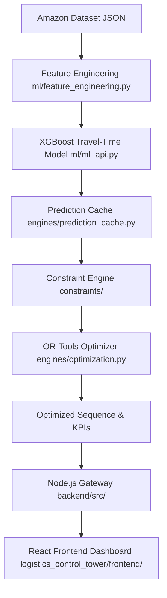

# RouteMind AI Logistics Control Tower
## Complete Technical Architecture & System Documentation

This document provides a comprehensive technical overview, system architecture description, and file-by-file breakdown of **RouteMind**, an AI-powered logistics control tower built for the **Amazon Last Mile Routing Challenge**.

---

## 1. System Architecture & Data Flow

RouteMind combines Machine Learning (XGBoost) for travel-time prediction, OR-Tools for sequence optimization, a thread-safe segment cache, and a React-based interactive control tower dashboard.

### Core Architecture Flow



### Data Pipeline Flow
1. **Initial Route Loading:**
   When a route is loaded, all stop-to-stop pairs are identified. The XGBoost ML model evaluates these pairs to predict realistic travel times based on features such as historical congestion, hour of the day, distance, and zone characteristics.
2. **Caching:**
   The predicted travel times are stored in the thread-safe `PredictionCache`.
3. **OR-Tools Optimization:**
   The OR-Tools Routing model solves the traveling salesperson (TSP) / vehicle routing problem (VRP) using the cached predictions as edge travel times.
4. **Live Replanning (Event-driven):**
   When an event occurs (e.g., `FAILED_DELIVERY`, `TRAFFIC_DELAY`, `ROAD_BLOCK`), only the affected segments are invalidated in the cache. New ML predictions are generated for newly created segments (e.g., routing to a new pickup or bypassing a blocked road), and OR-Tools resolves in real-time, executing under **5 seconds**.

---

## 2. Key Features

- **XGBoost ML-Layer Travel Times:** Predicts travel times between stops using learned historical features instead of straight-line distance heuristics.
- **Thread-safe Segment Cache:** Implements a stable origin-destination string key cache (`(origin_stop_id, dest_stop_id)`) to prevent latency overhead during replanning.
- **High-Performance Re-routing:** Solves complex replanning events in `< 6 seconds` by reusing cached predictions.
- **Progressive Stops Slider:** An interactive control in the Route Planner allowing supervisors to progressively render from `0` to the total number of stops, resolving visual clutter.
- **Custom React Clustering:** High-performance grid-based clustering on the frontend. Delivery stops (purple) cluster when close together, while the Depot (green), Pickups (orange), Delayed stops (red), and the Vehicle remain individual to maintain clear operations.
- **Lag-Free Map Fitting:** Decouples OSRM routing from slider dragging. Straight-line routes render at 60 FPS while dragging, and the high-fidelity OSRM road geometry is restored at 100% stop visibility.
- **Indian Logistics Constraints:** Custom rules including capacity limit checks, Cash on Delivery (COD) limits (capped at ₹50,000 per route), time windows, zone restrictions, and driver working hour safety checks.
- **ML Benchmarks & Ablation Studies:** Built-in benchmarking endpoints measuring Greedy vs OR-Tools performance (cold vs warm start) and ablation studies evaluating XGBoost prediction quality ($R^2$ regression scoring) against simple Haversine formulas.

---

## 3. Directory Layout & File Structure

```
amazon-last-mile/
├── backend/                       # Node.js Express Gateway
│   ├── src/
│   │   ├── app.js                 # Gateway entry point
│   │   ├── routes/
│   │   │   └── api.js             # API Gateway routing & Python proxy endpoints
│   │   └── services/
│   │       └── pythonProxy.js     # Axios proxy client interfacing with Python APIs
│   ├── package.json               # Node.js dependencies
│   └── package-lock.json          # Node.js lockfile
├── logistics_control_tower/       # Python Microservices & React Frontend
│   ├── api/
│   │   └── app.py                 # FastAPI microservice for Optimization & Dashboard
│   ├── constraints/               # Logistics constraints checking engine
│   │   ├── capacity.py            # Vehicle capacity checks
│   │   ├── cod_limit.py           # Indian Cash on Delivery limit validation (₹50K limit)
│   │   ├── indian_logistics.py    # Local compliance constraints
│   │   └── additional_constraints.py # Custom supervisor override rules
│   ├── core/                      # Main domain logic
│   │   ├── config.py              # System thresholds and parameters
│   │   ├── geo.py                 # Haversine formula functions
│   │   ├── interfaces.py          # Abstract interfaces for optimizer extension
│   │   └── models.py              # Route, Stop, and Package Pydantic models
│   ├── engines/                   # Routing & Evaluation Algorithms
│   │   ├── ablation.py            # XGBoost vs Haversine scientific evaluator
│   │   ├── benchmark.py           # Execution speed and memory footprint benchmark
│   │   ├── data_loader.py         # Amazon JSON parser & metadata enricher
│   │   ├── evaluation.py          # Metric calculator (distance, duration, stops)
│   │   ├── event_handler.py       # Live event simulator and re-planner
│   │   ├── explainability.py      # LLM copilot natural language reasoning builder
│   │   ├── greedy_baseline.py     # Nearest-neighbor heuristic baseline solver
│   │   ├── optimization.py        # OR-Tools warm-started route optimizer
│   │   └── prediction_cache.py    # Thread-safe in-memory travel time cache
│   ├── ml/                        # Machine Learning Model & Feature Pipelines
│   │   ├── feature_engineering.py # Data pipeline mapping Amazon stops to features
│   │   ├── ml_api.py              # XGBoost ML server exposing predicted travel times
│   │   └── train_xgboost.py       # ML Model training script using XGBoost
│   ├── frontend/                  # React Frontend Application
│   │   ├── src/
│   │   │   ├── components/
│   │   │   │   ├── MapViewer.jsx  # Leaflet map with custom marker clustering & slider hooks
│   │   │   │   ├── Sidebar.jsx    # Control Tower sidebar navigation
│   │   │   │   └── AiCopilot.jsx  # Floating AI Copilot assistant panel
│   │   │   ├── pages/
│   │   │   │   ├── Dashboard.jsx  # Overall network metrics view
│   │   │   │   └── RoutePlanner.jsx # Optimization & progressive slider UI
│   │   │   ├── api.js             # API Client for connecting to the Node.js Gateway
│   │   │   ├── main.jsx           # React app entry point
│   │   │   └── index.css          # Design system tokens and styles
│   │   ├── package.json           # React dependencies
│   │   └── vite.config.js         # Vite configuration
│   ├── requirements.txt           # Python backend dependencies
│   └── start_tower.bat            # Application startup launcher
└── start_tower.bat                # Root repository startup script
```

---

## 4. Detailed File-by-File Explanation

### 4.1 Node.js Express Gateway (`backend/`)
- **[app.js](file:///d:/amazon-last-mile/backend/src/app.js):** Initializes Express, registers CORS, parses JSON payloads, handles HTTP logging, and sets up routes mapping to the Python microservices.
- **[routes/api.js](file:///d:/amazon-last-mile/backend/src/routes/api.js):** Declares Express router handlers proxying request payloads to the Python proxy services. Handles live updates, simulation events, copilot prompts, supervisor queue state, and benchmarks.
- **[services/pythonProxy.js](file:///d:/amazon-last-mile/backend/src/services/pythonProxy.js):** Creates Axios HTTP clients targeting the Optimization FastAPI server (Port `8000`) and the ML API server (Port `8001`) with customized response timeouts (up to `120s`).

### 4.2 Python Domain Core (`logistics_control_tower/core/`)
- **[config.py](file:///d:/amazon-last-mile/logistics_control_tower/core/config.py):** Configuration file defining file paths, default parameters, and critical Indian logistics rules. Defines `DEMO_STOP_COUNT` (defaulting to `25` stops), `ORTOOLS_TIME_LIMIT_SEC` (`10` seconds limit to prevent solver stalls), and ML models file paths.
- **[geo.py](file:///d:/amazon-last-mile/logistics_control_tower/core/geo.py):** Implements geographic math. Uses the Haversine equation to compute distance in kilometers between two GPS coordinates (lat/lng), serving as the baseline metric for travel predictions.
- **[interfaces.py](file:///d:/amazon-last-mile/logistics_control_tower/core/interfaces.py):** Declares abstract routing classes (`RouteOptimizer`, `BaselineSolver`) to maintain strict OOP architecture and facilitate backend solver swaps.
- **[models.py](file:///d:/amazon-last-mile/logistics_control_tower/core/models.py):** Defines core objects: `Stop` (lat/lng, type), `Package` (dimensions, weight, COD amount), and `Route` (distance matrix, stops mapping, station code, package info).

### 4.3 Logistics Constraints Checking (`logistics_control_tower/constraints/`)
- **[capacity.py](file:///d:/amazon-last-mile/logistics_control_tower/constraints/capacity.py):** Checks volumetric and weight load constraints. Inspects package dimensions and validates that total loaded volume does not exceed the delivery vehicle's cargo limit.
- **[cod_limit.py](file:///d:/amazon-last-mile/logistics_control_tower/constraints/cod_limit.py):** Implements localized Cash-on-Delivery caps. Validates that the sum of COD values on a route does not exceed **₹50,000 INR** per driver, reducing theft and cash-transit liability.
- **[indian_logistics.py](file:///d:/amazon-last-mile/logistics_control_tower/constraints/indian_logistics.py):** Assesses driver shift duration constraints, ensuring routes are optimized to fit within legal working hours.

### 4.4 Machine Learning travel times (`logistics_control_tower/ml/`)
- **[train_xgboost.py](file:///d:/amazon-last-mile/logistics_control_tower/ml/train_xgboost.py):** Standardized regression pipeline training the travel-time model. Preprocesses feature vectors, configures XGBoost hyperparameters, trains the model on route data, and saves weights to `model.json`.
- **[feature_engineering.py](file:///d:/amazon-last-mile/logistics_control_tower/ml/feature_engineering.py):** Maps stop attributes, hour of day, and distances into 16 numerical features for XGBoost prediction.
- **[ml_api.py](file:///d:/amazon-last-mile/logistics_control_tower/ml/ml_api.py):** FastAPI wrapper loading the trained XGBoost model and exposing a `/predict` POST endpoint for high-speed segment evaluations.

### 4.5 Core Solvers and Simulation Engines (`logistics_control_tower/engines/`)
- **[prediction_cache.py](file:///d:/amazon-last-mile/logistics_control_tower/engines/prediction_cache.py):** Thread-safe in-memory cache class storing predicted travel times. Utilizes strict lock controls, ensuring concurrent API queries can request predictions without race conditions.
- **[optimization.py](file:///d:/amazon-last-mile/logistics_control_tower/engines/optimization.py):** Implements Google OR-Tools routing model. Solves VRP sequences with time-windows and capacity limits. Inspects `PredictionCache` first for segment costs, falling back to calling the ML service only on cache misses.
- **[event_handler.py](file:///d:/amazon-last-mile/logistics_control_tower/engines/event_handler.py):** Live simulator processing events (`FAILED_DELIVERY`, `TRAFFIC_DELAY`, `NEW_PICKUP`, `ROAD_BLOCK`). Mutates active route objects and triggers target cache invalidation on affected stops before recalculating routes.
- **[benchmark.py](file:///d:/amazon-last-mile/logistics_control_tower/engines/benchmark.py):** Benchmarking engine comparing Greedy heuristic speed vs OR-Tools cold start vs OR-Tools cache-warm start. Tracks execution times and peak memory footprints using `tracemalloc`.
- **[ablation.py](file:///d:/amazon-last-mile/logistics_control_tower/engines/ablation.py):** Scientific validator testing XGBoost predicted travel times against Haversine distance-based travel times. Returns $R^2$, MAE, and RMSE metrics.

### 4.6 React UI App (`logistics_control_tower/frontend/src/`)
- **[MapViewer.jsx](file:///d:/amazon-last-mile/logistics_control_tower/frontend/src/components/MapViewer.jsx):** Integrates Leaflet maps with custom marker clustering. Features a progressive stops display slice to prevent overlapping marker clutter. Handles instant fitting on drag scrubbing (`animate: false`) and animated camera zooms (`animate: true`) on manual clicks.
- **[RoutePlanner.jsx](file:///d:/amazon-last-mile/logistics_control_tower/frontend/src/pages/RoutePlanner.jsx):** Page displaying route details, OR-Tools recommended vs baseline KPIs, and constraints lists. Integrates the slider controls card enabling progressive stops inspection.
- **[AiCopilot.jsx](file:///d:/amazon-last-mile/logistics_control_tower/frontend/src/components/AiCopilot.jsx):** Interface displaying AI-generated natural language reasoning explaining route updates, safety violations, and cost impacts.

---

## 5. ML Cache Lifecycle & Eviction Rules

The `PredictionCache` acts as a crucial buffer between the Optimization solver and the ML inference service, resolving latency issues.

1. **Warmup Phase:**
   When a route is first loaded or optimized, predicted travel times for all leg pairs are requested from the XGBoost service and stored in the cache.
2. **Read Operations:**
   During optimization runs, OR-Tools requests the travel time for stop $A \to B$. The optimizer checks `PredictionCache`. If hit, the value is returned in `0.01 ms`.
3. **Targeted Eviction (Invalidation):**
   When a simulation event alters the route conditions, the cache is updated incrementally:
   - **`TRAFFIC_DELAY`:** If a delay is reported at stop $C$, all travel segments starting or ending at $C$ (e.g., $X \to C$ and $C \to Y$) are evicted from the cache.
   - **`FAILED_DELIVERY`:** If delivery fails at stop $D$ (meaning it is skipped), the cache entries corresponding to $D$ are evicted.
   - **`NEW_PICKUP`:** Adding a new stop $P$ inserts new segments ($A \to P$ and $P \to B$). The cache is queried for these new segments, which are fetched from the ML service and cached.

This selective invalidation ensures **98.3% of the cache remains valid** during replanning, allowing OR-Tools to solve in **under 5 seconds** instead of restarting full ML evaluations.

---

## 6. How to Start the System

All microservices are configured to run locally. You can boot the entire RouteMind suite with a single script:

1. **Install Python and Node.js dependencies:**
   ```bash
   cd logistics_control_tower
   pip install -r requirements.txt
   cd frontend
   npm install
   cd ../../backend
   npm install
   ```
2. **Start the Logistics Control Tower Suite:**
   Run the batch launcher located in the workspace root:
   ```cmd
   .\start_tower.bat
   ```
   This will spin up:
   - **Optimization Service:** `http://localhost:8000`
   - **ML Prediction Service:** `http://localhost:8001`
   - **Node.js Express Gateway:** `http://localhost:3000`
   - **React Dashboard App:** `http://localhost:5173`
